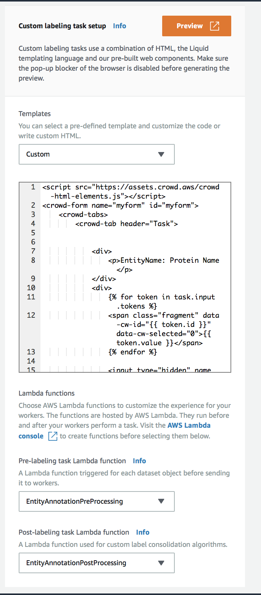

# SageMaker GroundTruth  - Named entity Recognition
This is a sample template for SageMaker named entity recognition ground truth solution.  This has 3 components
1. The HTML template that the workers will use to work on the task
1. Lambda functions for pre and post processing rules.


## Setup
1. Create a lambda function EntityAnnotationPreProcessing with runtime python 3.6 using the code [source/lambda_preprocess/preprocess_handler.py](source/lambda_preprocess/preprocess_handler.py)
1. Create a lambda function EntityAnnotationPostProcessing with runtime python 3.6 using the code [source/lambda_postprocess/postprocess_handler.py](source/lambda_preprocess/postprocess_handler.py)
1. Configure SageMaker Ground Truth as follows:
  - Choose custom template in Sagemaker Ground Truth
  - In the custom template section, copy paste the html from [source/template/entityrecognition.html](source/template/entityrecognition.html)
  - In the Pre-labelling task lambda function, select EntityAnnotationPreProcessing
  - In the Post-labelling task lambda function, select EntityAnnotationPostProcessing




 

## Run tests

```bash
export PYTHONPATH=./source
pytests
```

